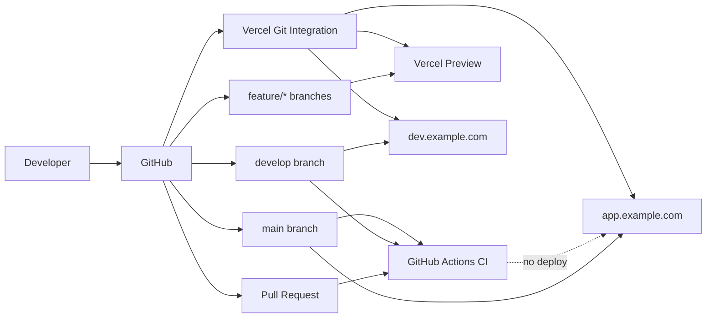

# Expentra Web — Deployment Guide

Production deployment for the Expentra React frontend (`expentra-web`).

## Architecture overview

| Layer | Service | Responsibility |
|-------|---------|----------------|
| Source control | GitHub | Code, PRs, branch protection |
| Continuous integration | GitHub Actions | Lint, typecheck, test, build verification |
| Hosting | Vercel | Build, deploy, CDN, HTTPS, custom domains |
| API | `expentra` backend (separate repo) | REST API consumed via `VITE_API_URL` |

GitHub Actions performs **CI only**. Vercel performs **all deployments** via its GitHub integration — no deploy steps in Actions.



## Branch strategy

| Branch | Purpose | Deployment |
|--------|---------|------------|
| `feature/*` | Feature work | Vercel Preview (unique URL per branch/PR) |
| `develop` | Integration / development | `dev.example.com` |
| `main` | Production | `app.example.com` |

No release or hotfix branches. Merge feature branches into `develop`, then promote to `main` via PR.

### Branch alignment (one-time)

The remote may still use legacy names (`dev`, `master`). Rename before enabling protection rules:

```bash
# On GitHub: Settings → Branches → rename, or via CLI
git branch -m dev develop
git branch -m master main
git push origin -u develop develop
git push origin -u main main
# Update default branch to main in GitHub Settings
```

## Continuous integration

Workflow: [`.github/workflows/ci.yml`](.github/workflows/ci.yml)

**Triggers:**

- Every pull request
- Pushes to `develop`
- Pushes to `main`

**Steps (fail-fast):**

1. Checkout
2. Setup pnpm (from `packageManager` in `package.json`)
3. Setup Node.js 22 with pnpm cache
4. `pnpm install --frozen-lockfile`
5. `pnpm lint`
6. `pnpm typecheck`
7. `pnpm test`
8. `pnpm build` (env from GitHub Actions secrets)

Any failure stops the workflow immediately.

### Required GitHub Actions secrets

Configure under **Settings → Secrets and variables → Actions**:

| Secret | Purpose |
|--------|---------|
| `VITE_API_URL` | API base URL used for the CI production build / CSP injection |
| `VITE_APP_ENV` | App environment label for the CI build (typically `production`) |

These values are not committed. Deployed environments still use the matching variables in Vercel.

## Vercel deployment flow

1. Connect the GitHub repo in [Vercel Dashboard](https://vercel.com/new).
2. Framework Preset: **Vite**
3. Root Directory: `.` (repository root)
4. Build Command: `pnpm build` (auto-detected)
5. Output Directory: `dist` (auto-detected)
6. Install Command: `pnpm install` (auto-detected; uses Corepack + `packageManager`)

**Automatic deployments:**

| Event | Vercel environment | URL |
|-------|-------------------|-----|
| Push to `main` | Production | `app.example.com` |
| Push to `develop` | Preview (branch alias) | `dev.example.com` |
| Push to `feature/*` or open PR | Preview | `*.vercel.app` |

Configure custom domains under **Project → Settings → Domains**:

- Production domain on `main`
- Assign `dev.example.com` to the `develop` branch (branch-specific domain in Vercel)

## Environments and variables

All `VITE_*` variables are **public** — embedded in the client bundle at build time. Never store secrets in Vite env vars.

| Variable | Development (`develop`) | Production (`main`) |
|----------|------------------------|---------------------|
| `VITE_API_URL` | Dev API URL (e.g. `https://api-dev.example.com/api/v1`) | Prod API URL (e.g. `https://api.example.com/api/v1`) |
| `VITE_APP_ENV` | `development` | `production` |

Set these in **Vercel → Project → Settings → Environment Variables**, scoped to Production and Preview respectively.

Local development: copy [`.env.example`](.env.example) to `.env` and adjust values.

## Local setup

**Requirements:** Node.js ≥ 20.19, pnpm 9+ (via Corepack)

```bash
corepack enable
pnpm install
cp .env.example .env
pnpm dev          # http://localhost:5173
pnpm lint         # ESLint
pnpm typecheck    # TypeScript
pnpm test         # Vitest
pnpm build        # Production build → dist/
pnpm preview      # Serve dist/ locally
```

## Build optimization

Handled by Vite defaults plus project config:

- **Tree shaking** and **code splitting** — Vite/Rollup defaults
- **Hashed asset filenames** — `/assets/*` cached for 1 year (`immutable`) via [`vercel.json`](vercel.json)
- **`index.html`** — `Cache-Control: no-cache` so clients always fetch the latest shell
- **Brotli/Gzip** — Vercel CDN compression (no custom tooling)
- **Source maps** — disabled in production (`vite.config.ts`) to avoid exposing source publicly

## Security

Security headers are defined in [`vercel.json`](vercel.json):

| Header | Value |
|--------|-------|
| Strict-Transport-Security | 2-year max-age, includeSubDomains, preload |
| X-Frame-Options | DENY |
| X-Content-Type-Options | nosniff |
| Referrer-Policy | strict-origin-when-cross-origin |
| Permissions-Policy | Restrictive (camera, microphone, geolocation, etc.) |
| Content-Security-Policy | Injected at **build time** into HTML from `VITE_API_URL` (see `vite.config.ts`) |

**HTTPS** is enforced automatically by Vercel.

**CSP `connect-src`:** Derived from `VITE_API_URL` during the Vercel build. Do **not** commit real API hosts into `vercel.json` — set them only as Vercel environment variables. Clickjacking is covered by `X-Frame-Options: DENY` (HTTP header), since `frame-ancestors` is not enforceable via HTML meta tags.

### Security checklist

- [ ] `VITE_API_URL` / `VITE_APP_ENV` set as GitHub Actions secrets (for CI builds)
- [ ] Matching `VITE_*` values set per environment in Vercel (for deployments)
- [ ] No real API hosts committed to the repository
- [ ] Branch protection enabled on `main` and `develop`
- [ ] CI status check required before merge
- [ ] Dependabot enabled (config in [`.github/dependabot.yml`](.github/dependabot.yml))

## Rollback strategy

Vercel keeps a deployment history for every push.

**Instant rollback (recommended):**

1. Vercel Dashboard → Deployments
2. Find the last known-good deployment
3. Click **⋯ → Promote to Production** (or **Instant Rollback**)

**Git-based rollback:**

1. Revert the offending commit on `main`
2. Push — Vercel auto-deploys the reverted state

For `develop`, promote a previous preview deployment or revert the commit the same way.

## Repository protection (manual GitHub settings)

These cannot be committed — configure in GitHub **Settings → Branches**:

### `main` and `develop`

- [ ] Require a pull request before merging
- [ ] Require status checks to pass: **CI**
- [ ] Require branches to be up to date before merging
- [ ] Do not allow bypassing the above settings
- [ ] Restrict who can push (no direct pushes)
- [ ] Do not allow force pushes

### Dependabot

Configured via [`.github/dependabot.yml`](.github/dependabot.yml). Enable in **Settings → Code security → Dependabot** if not already active.

## Troubleshooting

### CI fails on `pnpm install --frozen-lockfile`

Lockfile is out of sync with `package.json`. Run `pnpm install` locally and commit the updated `pnpm-lock.yaml`.

### Build fails with TypeScript errors

Run `pnpm typecheck` locally. Fix errors before pushing.

### Blank page after deploy / 404 on refresh

Ensure [`vercel.json`](vercel.json) rewrite to `/index.html` is present. Vercel serves static files before applying rewrites.

### API calls blocked by CSP

Check browser console for CSP violations. Ensure `VITE_API_URL` in Vercel matches the API origin the app calls, then redeploy so the build-time CSP is regenerated.

### Wrong API URL in deployed app

`VITE_*` vars are baked in at **build time**. Update the variable in Vercel for the target environment, then trigger a redeploy.

### Preview deployment uses production API

Verify Vercel environment variable scoping: Preview vars should differ from Production vars.

### Node version mismatch

Project requires Node ≥ 20.19 (`engines` in `package.json`). CI uses Node 22. Set the same in Vercel **Project → Settings → General → Node.js Version**.
